# Lexur Music Web

## 一、简介

FileServer作为文件上传服务器，接收上传的音乐，图片等信息。

MusicWeb作为音乐网站服务器，提供用户登录，后台管理等功能。

**主要功能：**

1.  音乐展示：显示音乐信息，播放音乐，音乐上传与下载
2.  收藏管理：对音乐进行收藏操作
3.  用户管理：管理对普通用户与管理员用户的增删改查
4.  分类管理：用户添加分类，音乐设置分类，分类的增删改查功能等

## 二、技术栈

**开发工具**

-   IDEA
-   Maven
-   JDK8
-   Tomcat8

**数据库**

| 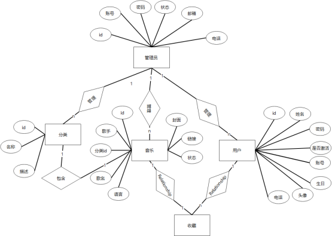 |
| :--------------------------------------------: |
|                   数据库ER图                   |

**前端**

-   html+css+javascript
-   Bootstrap

**后端**

-   SSM(Spring + Spring MVC + Mybatis)

## 三、界面展示

### 【1】登录页面

| 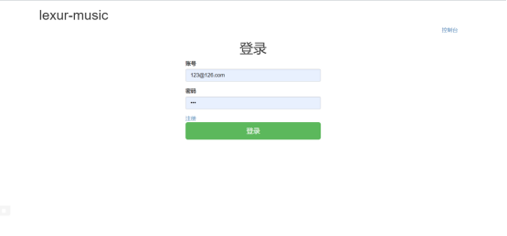 | 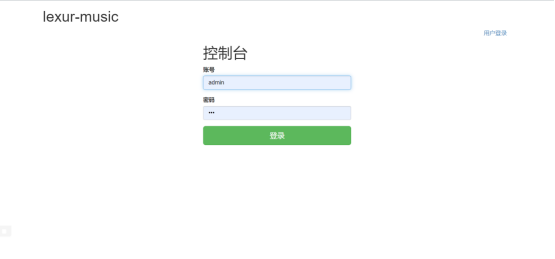 | 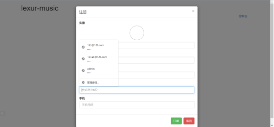 |
| :----------------------------------------------------------: | ------------------------------------------------------------ | ------------------------------------------------------------ |
|                           用户登录                           | 管理员登录                                                   | 用户注册                                                     |

### 【2】主页

| 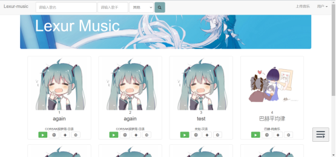 | 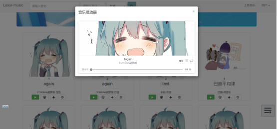 |
| :----------------------------------------------------------: | :----------------------------------------------------------: |
|                       **音乐网站主页**                       |                        **音乐播放器**                        |
| 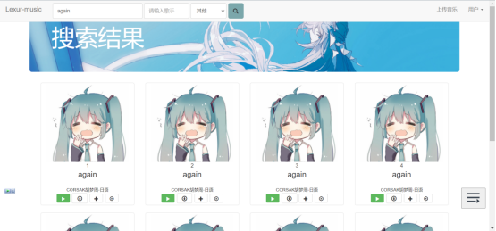 | 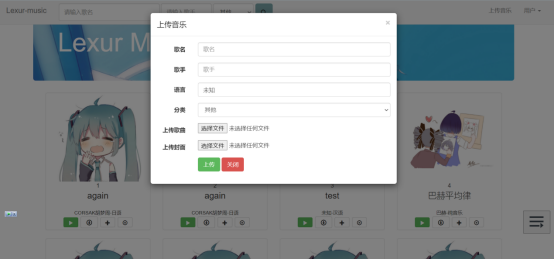 |
|                         **搜索音乐**                         |                         **上传音乐**                         |

### 【3】后台管理

|                           用户管理                           |                           音乐管理                           |                           分类管理                           |
| :----------------------------------------------------------: | :----------------------------------------------------------: | :----------------------------------------------------------: |
| 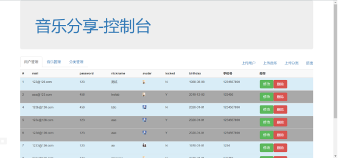 | 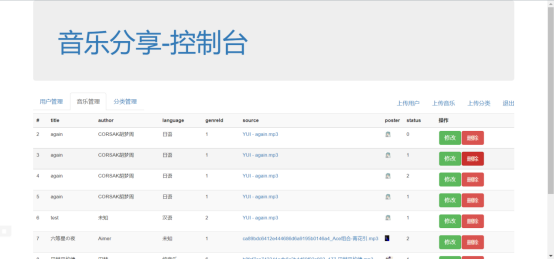 | 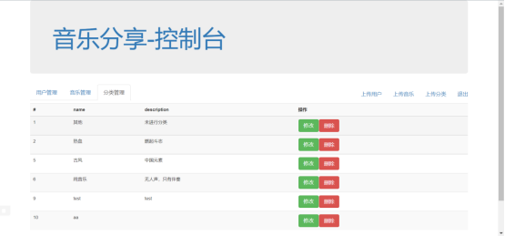 |

## 四、感悟

通过这次音乐网站的开发，我学会了很多东西。首先在不断使用IDEA中我逐渐学会了很多快捷方式，提高了打代码的效率。其次在这次项目中使用的了Spring与Spring MVC，从中我体会到了Spring的强大之处，可以大大减少代码量与开发周期。逐渐了解了Spring的几大特点如解耦合，控制反转，面向切面编程等强大之处。同时在制作过程中遇到了很多困难，通过网上查阅资料解决了大部分问题，逐渐学会了如何快速高效查询问题并解决问题。
